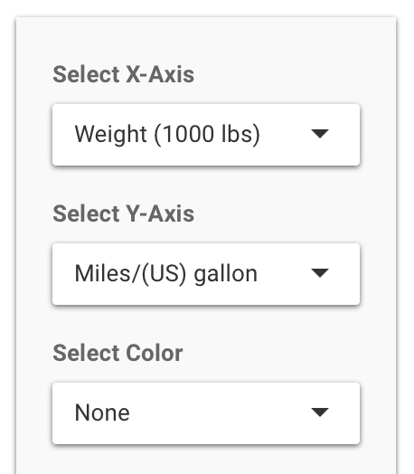
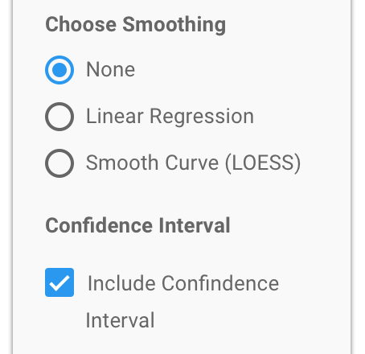

## Data

The data for the app comes from `mtcars` dataset provided by R. The dataset is titled <strong>Motor Trend Car Road Tests</strong> and was extracted from the 1974 <em>Motor Trend</em> US magazine, and comprises fuel consumption and 10 aspects of automobile design and performance for 32 automobiles (1973-74 models).


```r
library(knitr)
data(mtcars)
kable(head(mtcars))
```


|                  |  mpg| cyl| disp|  hp| drat|    wt|  qsec| vs| am| gear| carb|
|:-----------------|----:|---:|----:|---:|----:|-----:|-----:|--:|--:|----:|----:|
|Mazda RX4         | 21.0|   6|  160| 110| 3.90| 2.620| 16.46|  0|  1|    4|    4|
|Mazda RX4 Wag     | 21.0|   6|  160| 110| 3.90| 2.875| 17.02|  0|  1|    4|    4|
|Datsun 710        | 22.8|   4|  108|  93| 3.85| 2.320| 18.61|  1|  1|    4|    1|
|Hornet 4 Drive    | 21.4|   6|  258| 110| 3.08| 3.215| 19.44|  1|  0|    3|    1|
|Hornet Sportabout | 18.7|   8|  360| 175| 3.15| 3.440| 17.02|  0|  0|    3|    2|
|Valiant           | 18.1|   6|  225| 105| 2.76| 3.460| 20.22|  1|  0|    3|    1|

--- &twocol_width

## Inputs

*** =left width:80%

### Select Axes & Color

In the sidebar panel on the upper left of the app there are three dropbown boxes titled: <strong>Select X-Axis, Select Y-Axis, and Select Color</strong>. Each dropdown contains a list of all eleven variables of the `mtcars` dataset. Selecting a variable from the dropdown list changes the respective feature on the chart instantaneously.

### Choose Smoothing

In the sidebar panel on the middle left of the app under the heading <strong>Choose Smoothing</strong>  are three radio buttons. The default value is <em>None</em>. The second option <em>Linear Regresssion</em> adds a linear regression line with a confidence interval are to chart. The third toption <em>Smooth Curve (LOESS)</em> adds a smooth curve line through the data points.  
Below the <strong>Choose Smoothing</strong> radio buttons is a section heading <strong>Confidence Interval</strong> with a single checkbox. This turns the confidence interval shading area on and off around the smoothing line.

*** =right width:20%





---

## Links

### Motor Trend Vehicle Analysis app

[Web link](https://craigcovey.shinyapps.io/Motor_Trend_Analysis_Chart/)

### Github code

[link](https://github.com/CraigCovey/Motor_Trend_Analysis_Chart)

### This presentation

[Web link](https://craigcovey.github.io/Motor_Trend_Analysis_Chart/index.html)


